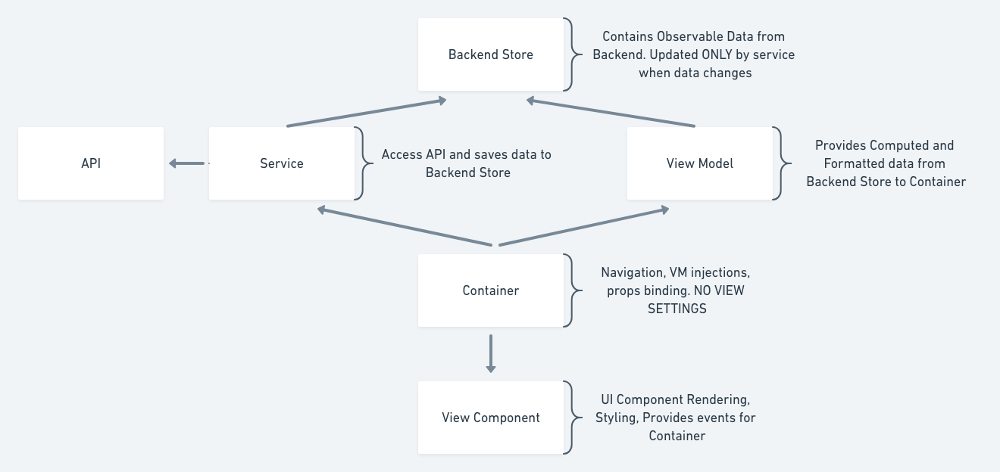

### Helpful links and overview

This sample is implemented to demonstrate how to use State Management with MobX in React Native mobile application.
It's based on store architecture approach, which is presented here in picture:

Key points from it:

Principal architecture parts and their ideas:

 - **Service** used to call from container, can get data from api and put into store
 - **Store** (backend store) is used to keep data from api. MobX works here, store contains `@observable` variables, `@action` functions and `@computed` properties. Can be used across several containers / view models
 - **ViewModel** brings all data from stores to container, with appropriate aggregations and / or filtrations. VM is one per container. MobX works here as well
 - **Container** calls service, put data from view model to View Component as react **props**. Should be marked with `@observer` decorator
 - **View Component** has template, styling and all about visualization. No state here, dependent only on input **props**

## Links

**In English**

* [MobX documentation](https://mobx.js.org/)
* [Redux documentation](https://redux.js.org/introduction/getting-started)
* [MobX 10 minutes Introduction](https://mobx.js.org/getting-started.html)
* [MobX vs Redux podcast](https://www.youtube.com/watch?v=83v8cdvGfeA)
* [MobX in React](https://github.com/mobxjs/mobx-react)
* [MobX in React Native](https://dev.to/satansdeer/react-native-mobx-tutorial---part-1--2df0)
* [Sample Project in GitHub](https://github.com/akveo/meetup-samples/tree/master/DevFestConf.Dec2018.RN.Mobx.Sample) You can clone it and play with React Native + MobX application

**In Russian**

* [https://habrahabr.ru/post/282578/](Habr Post about MobX)
* [https://habrahabr.ru/company/yandex/blog/339054/](Another habr post by Yandex about MobX)
* [http://5minreact.ru/20-mobx-over-redux/](Range of podcasts on topic)

## Contacts - Valentin Kononov

[LinkedIn](https://www.linkedin.com/in/valentin-kononov/)

Thanks!